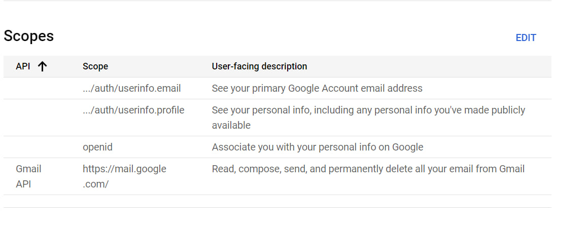

# CaesarServer

## Installation

Для установки проекта необходимо выполнить следующие шаги:

1. Перейти в каждый проект, кроме `startup` и `gateway`, и выполнить скрипт `build.sh`:
    ```bash
    ./build.sh
    ```

2. После создания всех образов перейти в директорию `planner-startup` и запустить контейнеры:
    ```bash
    cd ./planner-startup/
    docker compose up -d
    ```

3. Для запуска шлюза перейти в директорию `planner-gateway-service` и выполнить скрипт `start.sh`:
    ```bash
    cd ./planner-gateway-service/
    ./start.sh
    ```

## Environment setup (.env)

Настройка окружения в файле `.env` в директории `planner-startup`:

- **ASPNETCORE_ENVIRONMENT**: Установите `"Development"` для включения Swagger или `"Production"` для его отключения.
    ```plaintext
    ASPNETCORE_ENVIRONMENT="Development"
    ```

- **FILE_SERVER_URL**: Внешний URI для доступа к файловому серверу.
    ```plaintext
    FILE_SERVER_URL="http://localhost:8080"
    ```

- **EMAIL_SENDER_EMAIL** и **EMAIL_SENDER_PASSWORD**: Установите данные для отправки электронной почты. Получить пароль можно на странице [Google App Passwords](https://myaccount.google.com/apppasswords).
    ```plaintext
    EMAIL_SENDER_EMAIL=""
    EMAIL_SENDER_PASSWORD=""
    ```

- **GOOGLE_CLIENT_ID** и **GOOGLE_CLIENT_SECRET**: Получите на странице [Google API Credentials](https://console.cloud.google.com/apis/credentials). Добавьте в Authorized redirect URIs: `https://localhost:8888/signin-google` или `https://busfy.ru/signin-google`.
    ```plaintext
    GOOGLE_CLIENT_ID=""
    GOOGLE_CLIENT_SECRET=""
    ```
  

- **MAILRU_CLIENT_ID**, **MAILRU_CLIENT_SECRET**, и **MAILRU_REDIRECT_URI**: Получите на странице [Mail.ru Developer](https://o2.mail.ru/app#). Настройте `redirectUri` как `https://localhost:8888/signin-mail`.
    ```plaintext
    MAILRU_CLIENT_ID=""
    MAILRU_CLIENT_SECRET=""
    MAILRU_REDIRECT_URI="https://localhost:8888/signin-mail"
    ```


## Swagger API Documentation

Ниже представлены ссылки на Swagger документацию для каждого из сервисов. Swagger позволяет вам просматривать описание API, выполнять тестовые запросы и узнавать структуру данных, которые используются в сервисах.

- **Auth Service**: Документация для сервиса аутентификации.
  - `/auth/swagger`

- **File Service**: Документация для сервиса работы с файлами.
  - `/file/swagger`

- **Notification Service**: Документация для сервиса уведомлений.
  - `/notify/swagger`

- **Mailbox Service**: Документация для сервиса почтовых ящиков.
  - `/mailbox/swagger`

- **Email Service**: Документация для сервиса электронной почты.
  - `/email/swagger`

- **Chat Service**: Документация для сервиса чата.
  - `/chat/swagger`

- **Task Service**: Документация для сервиса задач.
  - `/task/swagger`